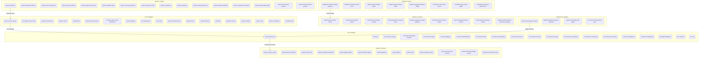

# Global Enterprise Architecture

```mermaid
graph TD
  %% Enterprise Architecture Graph

  subgraph xAI_Compute["xAI / Compute"]
    aazel-lexai-main("aazel-lexai-main")
    neonixai("neonixai")
    xai-colossus-cooling("xai-colossus-cooling")
    z-backup-mastermind-colossus("z-backup-mastermind-colossus")
    xai-colossal-cooling("xai-colossal-cooling")
    colossus-gateway("colossus-gateway")
    colossus-build-blueprint("colossus-build-blueprint")
    xai-colossus-build("xai-colossus-build")
    xai-colossus-waterplant("xai-colossus-waterplant")
    xai-colossus-servers("xai-colossus-servers")
    xai-colossus-security("xai-colossus-security")
    xai-colossus-energy("xai-colossus-energy")
    xai-colossus-nanosphere("xai-colossus-nanosphere")
    xai-colossus-community("xai-colossus-community")
    xai-colossus-microcode("xai-colossus-microcode")
    colossus-realignment("colossus-realignment")
    colossus2-realignment("colossus2-realignment")
    xai-legal-intelligence("xai-legal-intelligence")
    pro-colossus("pro-colossus")
    pro-xai("pro-xai")
  end

  subgraph SpaceX_Orbital["SpaceX / Orbital"]
    spacex-telemetry("spacex-telemetry")
    spacex-orbital-mechanics("spacex-orbital-mechanics")
    spacex-launch-sequencer("spacex-launch-sequencer")
    spacex-ground-network("spacex-ground-network")
    spacex-propulsion-monitor("spacex-propulsion-monitor")
    spacex-satellite-mesh("spacex-satellite-mesh")
    spacex-recovery-dynamics("spacex-recovery-dynamics")
    spacex-mission-control("spacex-mission-control")
    spacex-cryogenics("spacex-cryogenics")
    spacex-autonomy("spacex-autonomy")
    spacex-thermal-protection("spacex-thermal-protection")
    spacex-orbital-assembly("spacex-orbital-assembly")
    spacex-conjunction-sentinel("spacex-conjunction-sentinel")
    spacex-pad-weather-gate("spacex-pad-weather-gate")
    spacex-hold-reason-compiler("spacex-hold-reason-compiler")
    spacex-mission-thread-quorum("spacex-mission-thread-quorum")
  end

  subgraph OpenAI_Inference["OpenAI / Inference"]
    project_openai_codex("project_openai_codex")
    public-openai-client-php("public-openai-client-php")
    openai-codex-mcp("openai-codex-mcp")
    openai-assistants-quickstart("openai-assistants-quickstart")
    openai-agents-python("openai-agents-python")
    openai-realtime-agents("openai-realtime-agents")
    openai-agents-js("openai-agents-js")
    openai-python("openai-python")
    openai-node("openai-node")
    openai-assistant-swarm("openai-assistant-swarm")
    openai-reasoning-kv-sentinel("openai-reasoning-kv-sentinel")
    openai-reasoning-budget-futures("openai-reasoning-budget-futures")
    openai-tool-authority-matrix("openai-tool-authority-matrix")
  end

  subgraph AutonomousVehicles["Autonomous Vehicles"]
    tesla-fsd-occupancy-stream("tesla-fsd-occupancy-stream")
    waymo-phantom-freespace-certificate("waymo-phantom-freespace-certificate")
    waymo-uncertainty-lane-graph("waymo-uncertainty-lane-graph")
    zoox-fleet-skill-promotion-gate("zoox-fleet-skill-promotion-gate")
  end

  subgraph EnterpriseSaaS["Enterprise SaaS"]
    databricks-feature-lineage-passport("databricks-feature-lineage-passport")
    databricks-notebook-claim-fence("databricks-notebook-claim-fence")
    palantir-action-lineage-graph("palantir-action-lineage-graph")
    palantir-object-authority-matrix("palantir-object-authority-matrix")
    palantir-ontology-writeback-ledger("palantir-ontology-writeback-ledger")
    snowflake-cortex-claim-bound("snowflake-cortex-claim-bound")
    snowflake-query-intent-ledger("snowflake-query-intent-ledger")
    snowflake-warehouse-spend-circuit("snowflake-warehouse-spend-circuit")
  end

  subgraph Defense_Assured["Defense / Assured"]
    anduril-lattice-dissent-freeze("anduril-lattice-dissent-freeze")
    anduril-sensor-health-quorum("anduril-sensor-health-quorum")
    anduril-track-envelope-compiler("anduril-track-envelope-compiler")
    lockheed-dual-key-actuator-fence("lockheed-dual-key-actuator-fence")
    lockheed-evidence-binding-gateway("lockheed-evidence-binding-gateway")
    lockheed-mission-thread-isolator("lockheed-mission-thread-isolator")
    nasa-command-authority-half-life("nasa-command-authority-half-life")
    nasa-telemetry-anomaly-receipt("nasa-telemetry-anomaly-receipt")
    lockheed-martin-mission-assurance-gateway("lockheed-martin-mission-assurance-gateway")
  end

  subgraph CoreFlagships["Core Flagships"]
    nexus-cosmic-weave("nexus-cosmic-weave")
    ai-cognitive-nexus-mcp("ai-cognitive-nexus-mcp")
    operator-vault-nexus("operator-vault-nexus")
    legal-ai-nexus("legal-ai-nexus")
    mastermind("mastermind")
    master-memory-nexus("master-memory-nexus")
    z-backup-apex-nexus-automation("z-backup-apex-nexus-automation")
    nexus-legal-grid("nexus-legal-grid")
    pro-mastermind("pro-mastermind")
    nexus-api("nexus-api")
    apex-ish-mobile-nexus("apex-ish-mobile-nexus")
    genius-fusion("genius-fusion")
    mastermind-law("mastermind-law")
    monolith("monolith")
    quantum_nexus("quantum_nexus")
    genius-mastery("genius-mastery")
    genius-code("genius-code")
    genius-verification("genius-verification")
    monolith-map("monolith-map")
  end

  %% Integration Lines
  nexus-cosmic-weave -->|Orchestrates| aazel-lexai-main
  aazel-lexai-main -->|Provides KV Cache| project_openai_codex
  spacex-telemetry -->|Telemetry Sink| nexus-cosmic-weave
  tesla-fsd-occupancy-stream -->|Model Training| aazel-lexai-main
  databricks-feature-lineage-passport -->|Audit Lineage| anduril-lattice-dissent-freeze
```
